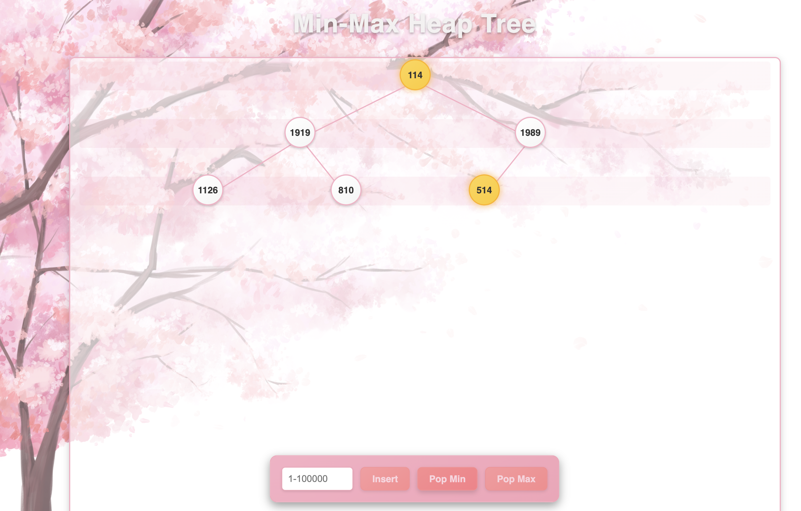

# DSA_Software Group 3 Min-Max Heap Visualizer

## Introduction

This program is a web-based application that demonstrates the *Min-Max Heap*, a special kind of binary heap that supports efficient retrieval of both the minimum and maximum elements. 

## How to Use

Website: https://didymos65803.github.io/DSA_Software/

### Insert
To insert a new number into the heap, enter the value in the input field and click the **Insert** button. The new node will appear in the tree, and the visualization will animate its proper placement in the Min-Max Heap 

### Pop Min
 
Click the Pop Min button to delete the smallest element (root) from the heap. The visualizer will highlight the root(Red), remove it, and then promote the appropriate child to root, animating the heapify down process on min-levels to restore the Min-Max order. 

### Pop Maximum: 
Click the Pop Max button to remove the largest element. The visualizer will identify the current maximum (one of the root’s children on the first max level, showing red node), remove it, and then reheapify down on a max-level to maintain the structure. 

### Constraint

- 1< input < 100000
- only interger is vaild input

### Contribution

- PM:謝承安
- FE:許婕恩、李建緯 
- BE:龔德恩、陳芊竹
- QA:鄭郁倫